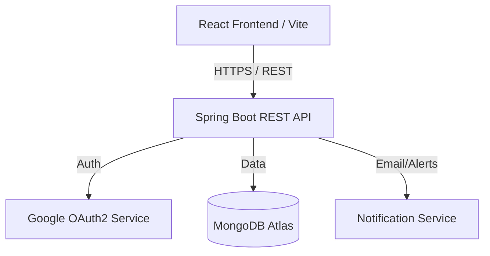
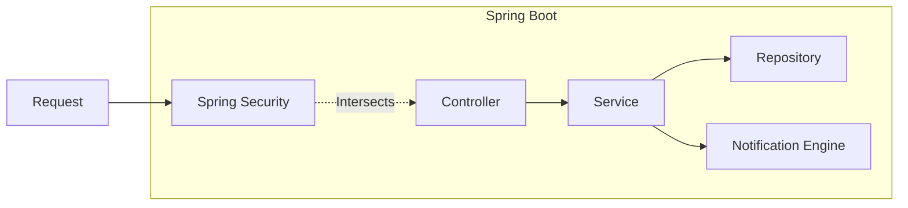
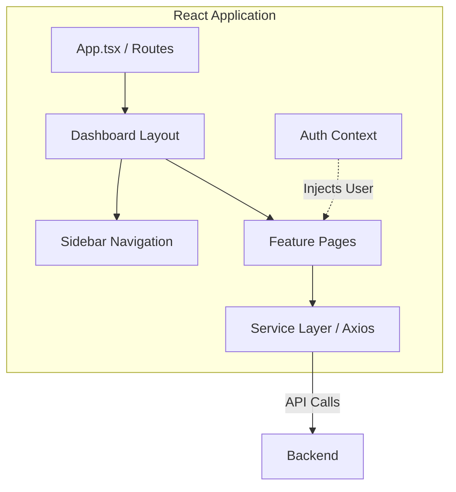

# Smart Campus Hub - Technical Documentation

## 1. Requirements Identification

### 1.1 Functional Requirements
*   **User Management & Auth**: Users can log in via Google OAuth2 or credentials. Roles (Student, Admin, Technician) determine access levels.
*   **Facility Booking**: Students can browse availability and book campus halls/labs. Admins can approve or reject these bookings.
*   **Ticketing System**: Students can raise maintenance tickets with image attachments.
*   **Technician Console**: Technicians can self-assign tickets, update progress, and provide resolution notes.
*   **Unified Notifications**: Role-based notifications for booking status updates and ticket assignments.

### 1.2 Non-Functional Requirements
*   **Security**: Role-Based Access Control (RBAC) enforced on both React routes and Spring Boot API endpoints.
*   **Performance**: Fast UI rendering using Vite and optimized Tailwind CSS. Backend responses handled via non-blocking Spring Boot controllers.
*   **Scalability**: Stateless REST API design allowing for horizontal scaling. MongoDB document storage for flexible data schema.
*   **Usability**: Premium, responsive mobile-first design with micro-animations (Framer Motion) and high-contrast accessibility.

---

## 2. Architecture Design

### 2.1 Overall System Architecture
Describes the interaction between the tiered layers of the application.

### 2.2 REST API Architecture (Backend)
Shows the internal request flow within the Spring Boot application.

### 2.3 Frontend Architecture
Describes the React component and state management structure.

---

## 3. Implementation Details
*   **Backend**: Spring Boot 3.5.0, MongoDB, Spring Security (JWT-based session extraction).
*   **Frontend**: React 18, TypeScript, Tailwind CSS, Lucide icons, Framer Motion.
*   **Database**: Document-oriented storage in MongoDB for flexible ticketing and booking entities.
